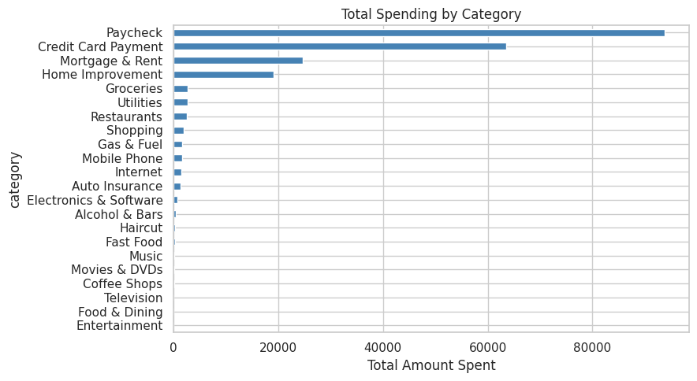
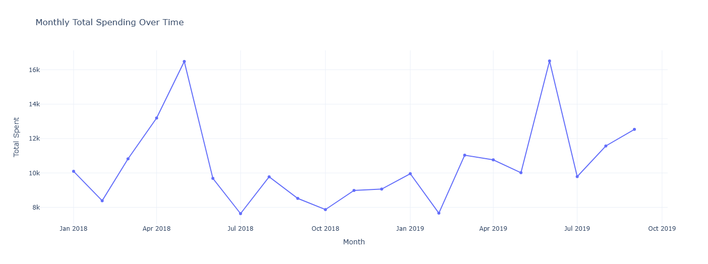
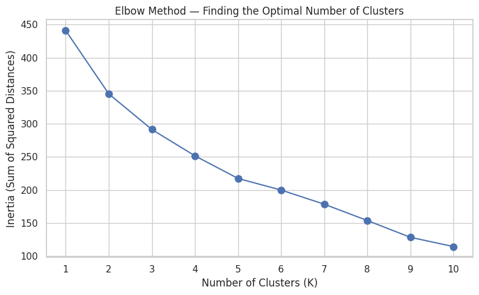
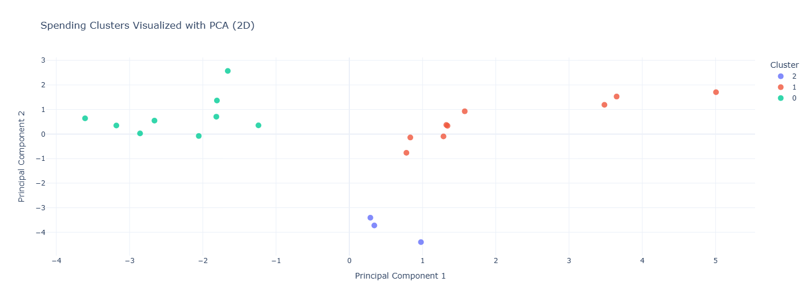
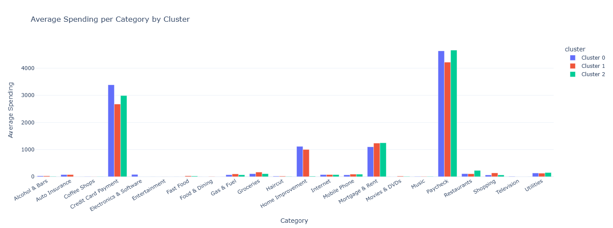

# Spending Pattern Analyzer — K-Means Clustering

A machine learning project that analyzes monthly personal finance data and clusters spending patterns using K-Means clustering, helping identify distinct spending behaviors across months.

---

## Overview

This project takes a personal finance dataset (date, category, amount) and uses unsupervised machine learning to group months into clusters based on spending behavior — revealing patterns like "high rent months," "frugal months," or "high entertainment & dining months."

---

## Concepts Used

| Concept | Purpose |
|---|---|
| **StandardScaler** | Normalizes spending values across categories so no single category dominates due to scale differences |
| **K-Means Clustering** | Groups months into clusters based on similar spending patterns |
| **Elbow Method** | Determines the optimal number of clusters (K) by plotting inertia vs K |
| **PCA (Principal Component Analysis)** | Reduces multi-dimensional spending data to 2D for visualization |
| **Pivot Table** | Transforms transaction-level data into a month x category feature matrix |

---

## Workflow

1. **Data Cleaning** — Load CSV, standardize column names, auto-detect date/category/amount columns
2. **Exploratory Analysis** — Visualize total spending by category and monthly spending trends
3. **Feature Engineering** — Build a feature matrix (rows = months, columns = spending categories)
4. **Feature Scaling** — Apply StandardScaler to normalize the feature matrix
5. **Optimal K Selection** — Use the Elbow Method to choose the right number of clusters
6. **Clustering** — Run K-Means and assign each month to a cluster
7. **Cluster Profiling** — Calculate average spending per category for each cluster
8. **Visualization** — Use PCA to plot clusters in 2D and compare cluster spending profiles

---

## Key Insights

- Three distinct spending patterns emerged across months
- **Mortgage & Rent** and **Paycheck** categories showed the highest variance across clusters, making them the strongest differentiators between spending behaviors
- Clusters with higher **Paycheck** values also tended to show proportionally higher discretionary spending (Movies & DVDs, Shopping)
- The Elbow Method confirmed K=3 as the optimal number of clusters for this dataset

---

## Screenshots

### Spending by Category


### Monthly Spending Trend


### Elbow Method


### PCA Clusters


### Average Spending Per Cluster


---

## Tech Stack

- Python
- Pandas, NumPy
- Scikit-learn (StandardScaler, KMeans, PCA)
- Matplotlib, Seaborn
- Plotly (interactive visualizations)

---

## How to Run

1. Clone the repository
```bash
git clone https://github.com/<your-username>/spending-pattern-analyzer-kmeans
```

2. Open `spending_cluster.ipynb` in Google Colab or Jupyter Notebook

3. Run all cells — when prompted, upload the dataset CSV

4. Adjust `CHOSEN_K` value based on the Elbow Method chart if needed

---

## Dataset

Personal finance dataset containing transaction-level data with Date, Category, and Amount columns.

---

## Author

**Nehal Rathi**
Third Year B.Tech Student
[GitHub](https://github.com/nehalnrathi18-dotcom)
